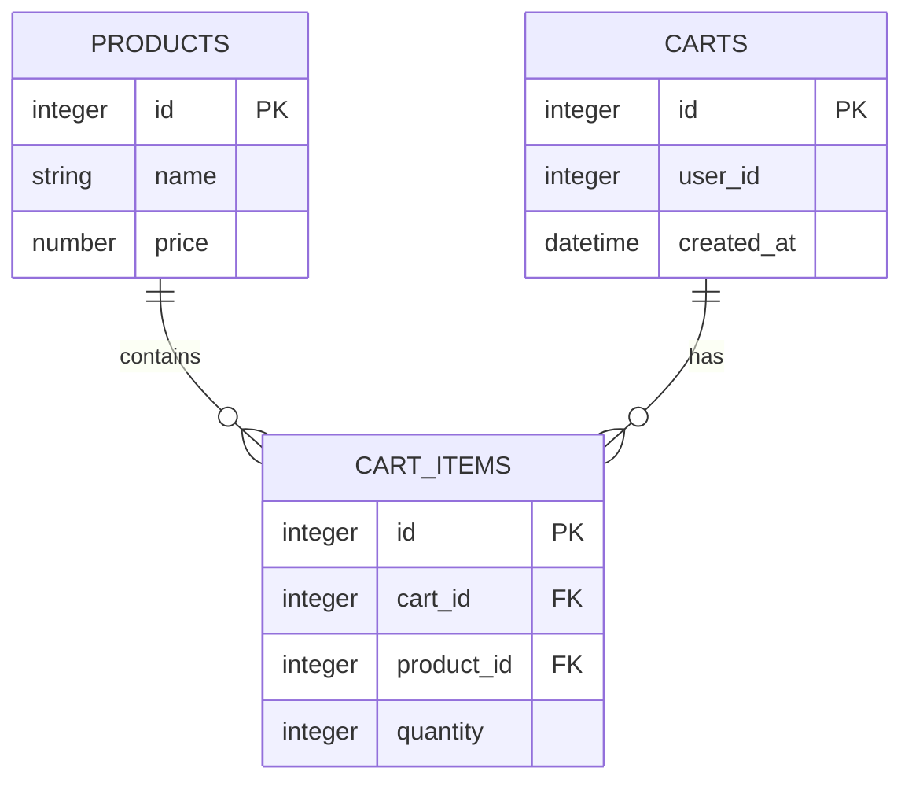

# Exemplo: Schema SQL para um Carrinho Simples

```sql
CREATE TABLE products (
  id INTEGER PRIMARY KEY,
  name TEXT NOT NULL,
  price NUMERIC NOT NULL
);

CREATE TABLE carts (
  id INTEGER PRIMARY KEY,
  user_id INTEGER NOT NULL,
  created_at TIMESTAMP DEFAULT CURRENT_TIMESTAMP
);

CREATE TABLE cart_items (
  id INTEGER PRIMARY KEY,
  cart_id INTEGER NOT NULL REFERENCES carts(id),
  product_id INTEGER NOT NULL REFERENCES products(id),
  quantity INTEGER NOT NULL DEFAULT 1
);
```

Mermaid ER diagram (se seu gerador suporta mermaid):



Use este esquema para exercícios de verificação de dados, consultas SQL para QA e para simular cenários de integração.